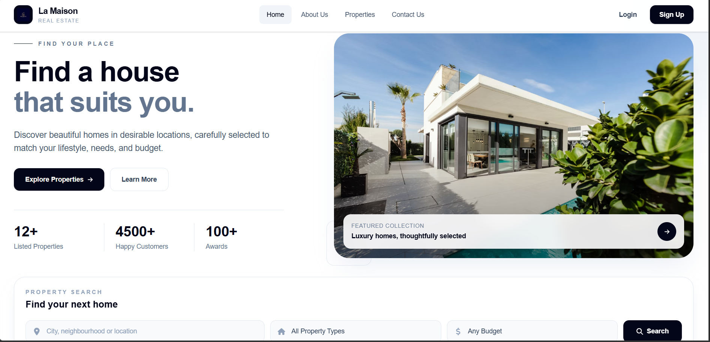
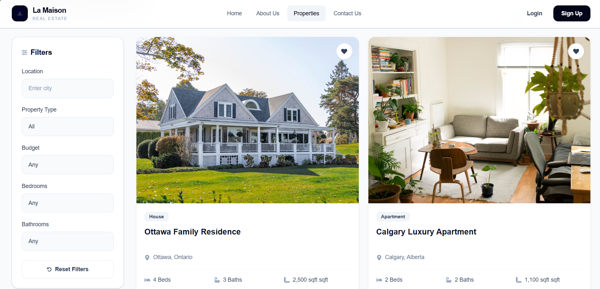
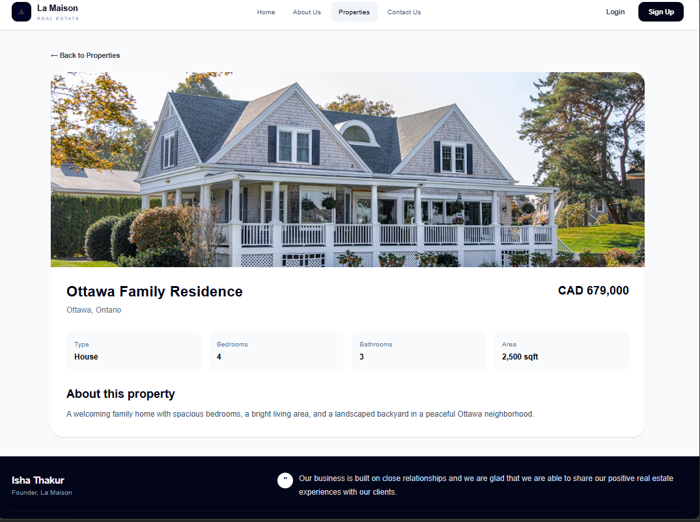
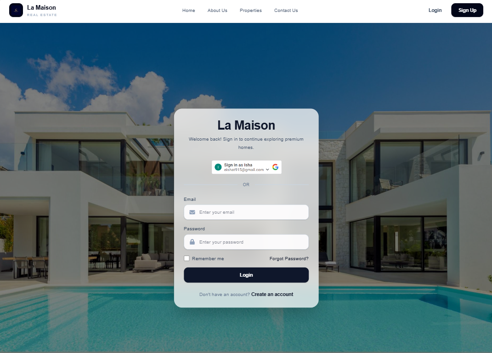
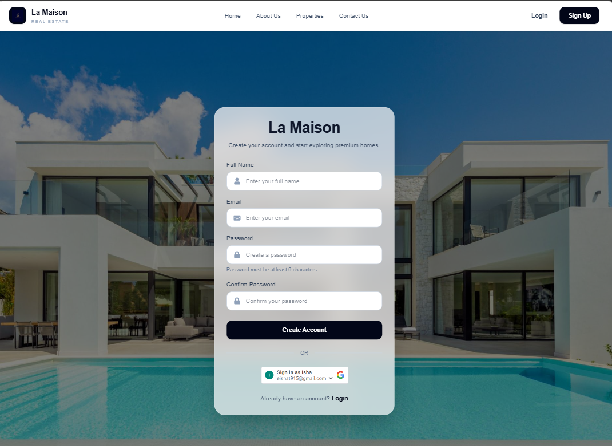
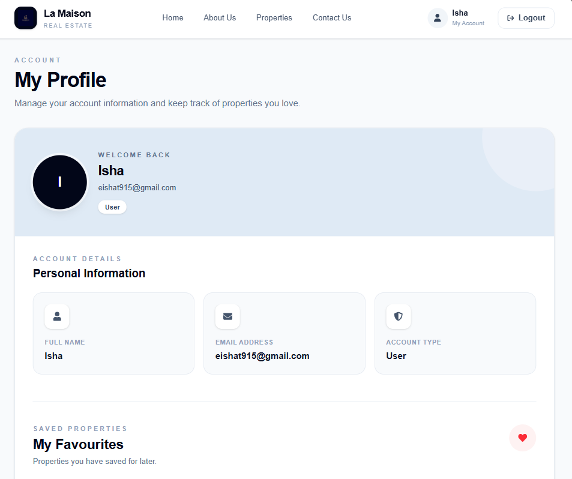
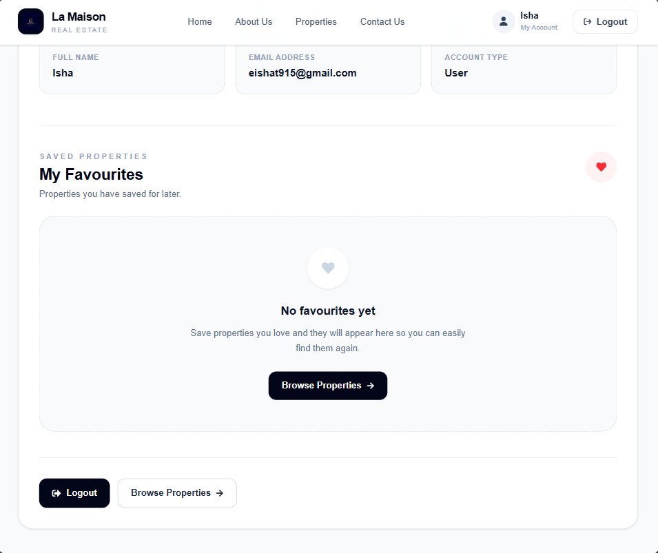

# 🏠 La Maison

## Full-Stack Real Estate Platform

La Maison is a full-stack real estate web application designed to help users discover, search, and manage property listings through a modern and responsive interface.

The application includes property browsing, search and filtering, user authentication, Google authentication, user profiles, favorites, contact inquiries, and role-based functionality.

🔗 **Live Demo:**  
https://lamaisonreal-estate.netlify.app

💻 **GitHub Repository:**  
https://github.com/ishat005/real-estate

---

## 📸 Screenshots

### 🏠 Homepage



The homepage introduces the platform, displays property statistics and featured properties, and provides a search interface for users to find homes.

---

### 🏘️ Property Listings



Users can browse available properties and search for homes based on location, property type, and budget.

---

### 🏡 Property Details



Each property has a dedicated details page containing information such as price, location, bedrooms, bathrooms, area, images, and other property information.

---

### 🔐 Login



Users can sign in using email/password authentication or Google authentication.

---

### 📝 Signup



New users can create an account using email/password or Google authentication.

---

### 👤 User Profile



Authenticated users can access their profile and manage their personalized property information.

---

### ❤️ Favorites



Authenticated users can save properties to their favorites and manage their saved properties from their account.

---

# ✨ Features

## 🏠 Property Discovery

- Browse available property listings
- View featured properties
- View detailed property information
- View property images
- View property prices
- View property locations
- View bedrooms and bathrooms
- View property area
- Access individual property detail pages

## 🔎 Search & Filtering

Users can search properties using:

- 📍 Location
- 🏘️ Property type
- 💰 Budget

Search criteria are passed to the property listing page to help users find relevant properties.

## ❤️ Favorites

Authenticated users can:

- Add properties to favorites
- Remove properties from favorites
- View saved properties
- Manage their favorite properties

Favorites are associated with the authenticated user's account.

## 🔐 Authentication

The application includes:

- User registration
- Email/password login
- Google authentication
- JWT-based authentication
- Protected routes
- Persistent authentication state
- Logout functionality
- User-specific functionality

## 👤 User Profiles

Authenticated users have access to their own profile and personalized property information.

## 🛡️ Role-Based Functionality

The application supports role-based functionality for different user workflows and protected operations.

## 📩 Contact Inquiries

Users can submit contact inquiries through the application.

Contact information is processed through the backend and integrated with EmailJS for notifications.

## 📱 Responsive Design

The application is designed to provide a responsive experience across:

- Desktop
- Tablet
- Mobile

---

# 🛠️ Tech Stack

### Frontend

- React
- JavaScript
- React Router
- Tailwind CSS
- Vite
- React Icons

### Backend

- Node.js
- Express.js
- REST APIs
- JWT
- Mongoose

### Database

- MongoDB

### Authentication

- JWT Authentication
- Google OAuth

### Services & Deployment

- Netlify
- Render
- EmailJS

### Development Tools

- Git
- GitHub
- Postman
- VS Code

---

# 🏗️ Application Architecture

La Maison follows a client-server architecture where the React frontend communicates with the Node.js/Express backend through REST APIs.

```text
                    ┌──────────────────────┐
                    │      React App       │
                    │      Frontend        │
                    │                      │
                    │ React + Vite         │
                    │ Tailwind CSS         │
                    │ React Router         │
                    └──────────┬───────────┘
                               │
                               │ REST API
                               ▼
                    ┌──────────────────────┐
                    │    Express / Node    │
                    │       Backend        │
                    │                      │
                    │ Authentication       │
                    │ Property APIs        │
                    │ Favorites APIs       │
                    │ Contact APIs         │
                    └──────────┬───────────┘
                               │
                               │ Mongoose
                               ▼
                    ┌──────────────────────┐
                    │       MongoDB        │
                    │       Database       │
                    └──────────────────────┘
```

---

# 🧩 Challenges & Solutions

### Frontend & Backend Integration

One of the main challenges was connecting the React frontend to a separate Node.js/Express backend. I implemented REST API communication and used environment variables to keep API configuration flexible between local development and production.

### CORS Configuration

Because the frontend and backend are deployed separately, cross-origin requests required proper CORS configuration. The Express backend was configured to allow requests from the appropriate frontend environments.

### Authentication

Implemented JWT-based authentication for email/password login and registration, along with Google authentication.

Authentication state is managed through React Context so that user-specific features remain available throughout the application.

### Protected Routes & User-Specific Features

Implemented protected routes and API authorization for features that require authentication, including user profiles and saved properties.

### Favorites System

Built a user-specific favorites system that allows authenticated users to add and remove properties. Favorite properties are stored in the backend and associated with the authenticated user.

### Search & Filtering

Implemented property search functionality using location, property type, and budget criteria.

Search parameters are passed between the homepage and property listing page to provide a consistent user experience.

### Google Authentication

Integrated Google OAuth into the authentication flow and connected Google login/signup with the application's existing authentication state.

### Responsive UI

Designed responsive layouts using Tailwind CSS so that property listings, navigation, authentication pages, forms, and other components adapt across desktop, tablet, and mobile screen sizes.

### Frontend Error Handling

Handled API failures and loading states in the React application so users receive appropriate feedback when property data or other backend requests cannot be loaded.

### Deployment & Environment Configuration

Deployed the frontend and backend as separate services and configured environment variables so the application can switch between local development and the production API.

---

# 🚀 Run Locally

## Prerequisites

Make sure you have the following installed:

- Node.js
- npm
- MongoDB
- Git

Google OAuth credentials are required if you want to test Google authentication locally.

---

## 1. Clone the Repository

```bash
git clone https://github.com/ishat005/real-estate.git
cd real-estate
```

---

## 2. Install Dependencies

Install the project dependencies from the root directory:

```bash
npm install
```

If the backend has its own dependencies inside the `server` directory, install those as well:

```bash
cd server
npm install
cd ..
```

---

## 3. Configure Environment Variables

Create the required `.env` files based on the environment variables used by the application.

The application uses environment variables for:

- API configuration
- MongoDB connection
- Google authentication
- Authentication settings
- Other environment-specific configuration

> **Important:** Never commit passwords, API keys, database credentials, or other sensitive information to GitHub.

---

## 4. Start the Backend

Start the Node.js/Express backend using the server configuration in the `server` directory.

For example, if the project uses a development script:

```bash
cd server
npm run dev
```

Keep the backend terminal running.

---

## 5. Start the Frontend

Open a new terminal and return to the project root:

```bash
cd real-estate
npm run dev
```

The Vite development server will normally be available at:

```text
http://localhost:5173
```

---

# 📁 Project Structure

The project uses a single repository containing the React frontend at the root level and the Node.js/Express backend inside the `server` directory.

```text
real-estate/
│
├── public/
│
├── screenshots/
│   ├── homepage.png
│   ├── properties.png
│   ├── property-details.png
│   ├── login.png
│   ├── signup.png
│   ├── profile.png
│   └── favorites.png
│
├── server/
│   └── ...
│
├── src/
│   ├── assets/
│   ├── components/
│   ├── context/
│   ├── pages/
│   ├── services/
│   ├── App.jsx
│   └── main.jsx
│
├── .gitignore
├── eslint.config.js
├── index.html
├── package.json
├── package-lock.json
├── README.md
└── vite.config.js
```

> The structure above highlights the main project directories. Individual files inside `src` and `server` may vary as the application evolves.

---

# 🌐 Deployment

The application is deployed using separate frontend and backend services.

### Frontend

The React frontend is deployed using Netlify.

🔗 **Live Application:**  
https://lamaisonreal-estate.netlify.app

### Backend

The Node.js/Express backend is deployed using Render.

The frontend communicates with the deployed backend through REST APIs.

Environment variables are configured separately for local development and production.

---

# 🔮 Future Development

La Maison can be expanded with additional features as the platform evolves.

Potential future improvements include:

- 🗺️ Map-based property search
- 🔎 Advanced property filtering and sorting
- ⚖️ Property comparison
- 💰 Mortgage and payment calculator
- 🏢 Expanded admin dashboard
- 🏡 Property management functionality
- 🔑 Password reset and account recovery
- 📧 Additional email notifications
- 🔔 User notification system
- ♿ Additional accessibility improvements
- ⚡ Further frontend performance optimizations
- 🖼️ Improved property image management
- 👤 Additional user profile functionality
- 📱 Further mobile UX improvements

---

# 👩‍💻 Author

## Isha Thakur

Full-Stack Developer focused on building responsive and user-friendly web applications using React, Node.js, Express, and MongoDB.

### Portfolio

https://isha-thakur.netlify.app/

### GitHub

https://github.com/ishat005

### La Maison

https://lamaisonreal-estate.netlify.app

---

# 📌 Project Status

La Maison is a portfolio project demonstrating full-stack application development, including:

- React frontend development
- Node.js and Express backend development
- REST API integration
- User authentication
- Google OAuth integration
- MongoDB database interaction
- Protected user functionality
- Responsive UI development
- Frontend/backend integration
- Deployment and environment configuration

The project may continue to evolve with additional features and improvements.